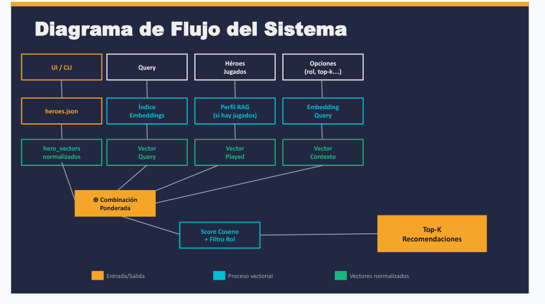

# OW RAG Multimodal


Overwatch hero recommender built on **semantic embeddings + RAG + CLIP visual analysis**. Given a playstyle description and your hero history, it returns the best hero picks ranked by vector similarity — fully local, no API key required.

---

## How it works

The engine operates entirely in normalized vector space. There are no keyword rules, no hardcoded scores.

1. **Embed** every hero's description using `all-MiniLM-L6-v2` (sentence-transformers, runs locally).
2. **Cache** the resulting matrix on disk with SHA-256 content validation — zero re-computation on re-runs.
3. **Encode the query** into the same vector space.
4. **Build a RAG player profile** from your previously played heroes: retrieve semantically similar context, extract style traits, and produce a summary.
5. **Combine three signals** with fixed weights:
   - Query vector — `0.6`
   - Played-heroes centroid — `0.05`
   - Retrieved-context centroid — `0.35`
6. **Optionally blend CLIP visual signal** (`clip-ViT-B-32`) for cross-modal image similarity.
7. **Rank** all heroes by cosine similarity (dot product on L2-normalized vectors) and return the top-K, optionally filtered by role.



```
flowchart TD
    A[UI / CLI] --> B[Query + Played Heroes]
    B --> C[Embedding Index]
    C --> D[hero_vectors normalized]
    B --> E[RAG Profile Builder]
    E --> F[Retrieved Context]
    D & F --> G[Weighted Combination]
    G --> H[+ CLIP visual signal optional]
    H --> I[Cosine Score + Role Filter]
    I --> J[Top-K Recommendations + Image Gallery]
```

---

## Project structure

```
ow-rag-multimodal/
├── data/
│   ├── heroes.json           # Hero catalog with role and description
│   ├── images/               # Hero portrait PNGs (one per hero slug)
│   └── cache/                # .npy vectors + metadata (gitignored)
├── src/ow_rag_multimodal/
│   ├── cli.py                # Argparse CLI entry point
│   ├── data.py               # Hero loading and fuzzy-name resolution
│   ├── embeddings.py         # Embedding clients (OpenAI + SentenceTransformer), cache
│   ├── history.py            # Play history persistence
│   ├── image_embeddings.py   # CLIP image index with in-memory model cache
│   ├── models.py             # Dataclasses: HeroDoc, Recommendation, PlayerProfile
│   ├── rag.py                # HeroRAG: retrieval + profile synthesis
│   ├── recommender.py        # OWRAGMultimodalRecommender: full pipeline
│   └── ui.py                 # Gradio web interface
├── docs/
│   ├── assets/
│   │   └── system_diagram.png
│   ├── notes/                # Working notes and presentation materials
│   ├── eval_report.tex
│   ├── results_baseline.txt
│   └── results_tuning.txt
├── scripts/
│   └── download_images.py
├── .env.example
└── pyproject.toml
```

---

## Setup

```bash
python3 -m venv .venv
source .venv/bin/activate
pip install -e '.[multimodal]'
```

The system auto-detects which embedding backend to use:

| Condition | Text model used |
|---|---|
| `OPENAI_API_KEY` set in environment | `text-embedding-3-small` (OpenAI API) |
| No API key | `all-MiniLM-L6-v2` (local, sentence-transformers) |

**With OpenAI key:**
```bash
export OPENAI_API_KEY=sk-...
ow-rag-ui
```

**Without API key (fully local):**
```bash
ow-rag-ui
```

On first local run, sentence-transformers will download:
- `all-MiniLM-L6-v2` (~80 MB) — text embeddings
- `clip-ViT-B-32` (~600 MB) — visual embeddings

Both are cached locally after the first download.

---

## Usage

### Web UI

```bash
ow-rag-ui
```

Opens at `http://127.0.0.1:7860`. Select heroes → describe your playstyle → hit **Recomendar**.

Available options:
- **Filtrar por rol** — Tank / Damage / Support
- **Número de recomendaciones** — 1 to 10
- **Peso del análisis visual** — blend ratio for CLIP image signal (0 = text only, 1 = image only)
- **Recordar mis héroes frecuentes** — includes play history in the RAG profile
- **Ver detalle del análisis** — shows retrieved context and style traits

### CLI — query only

```bash
ow-rag --query "aggressive frontline, high pressure" --top-k 5
```

### CLI — query + play history

```bash
ow-rag \
  --query "sustain pressure and enable teammates" \
  --played reinhardt zarya \
  --top-k 5 \
  --show-context
```

`--played` accepts slugs or hero names (case-insensitive fuzzy match).

---

## Key design choices

| Decision | Reason |
|---|---|
| `all-MiniLM-L6-v2` instead of OpenAI API | Fully local, no cost, no quota limits, comparable quality for this domain |
| CLIP `clip-ViT-B-32` for image signal | Shared text+image embedding space enables cross-modal similarity |
| In-memory CLIP model cache | Avoids reloading ~600 MB on every query — critical for CPU-only environments |
| L2-normalized dot product | Equivalent to cosine similarity, faster batch scoring with `matrix @ vector` |
| SHA-256 cache signature | Detects catalog changes without storing timestamps |
| Weighted centroid fusion | Simpler and faster than late fusion or re-ranking |
| Gradio stateful callbacks | Keeps recommender alive across requests — one index build per session |

---

## Requirements

- Python 3.10+
- `numpy >= 1.26`
- `gradio >= 5.0`
- `sentence-transformers >= 3.0`
- `Pillow >= 10.0`
