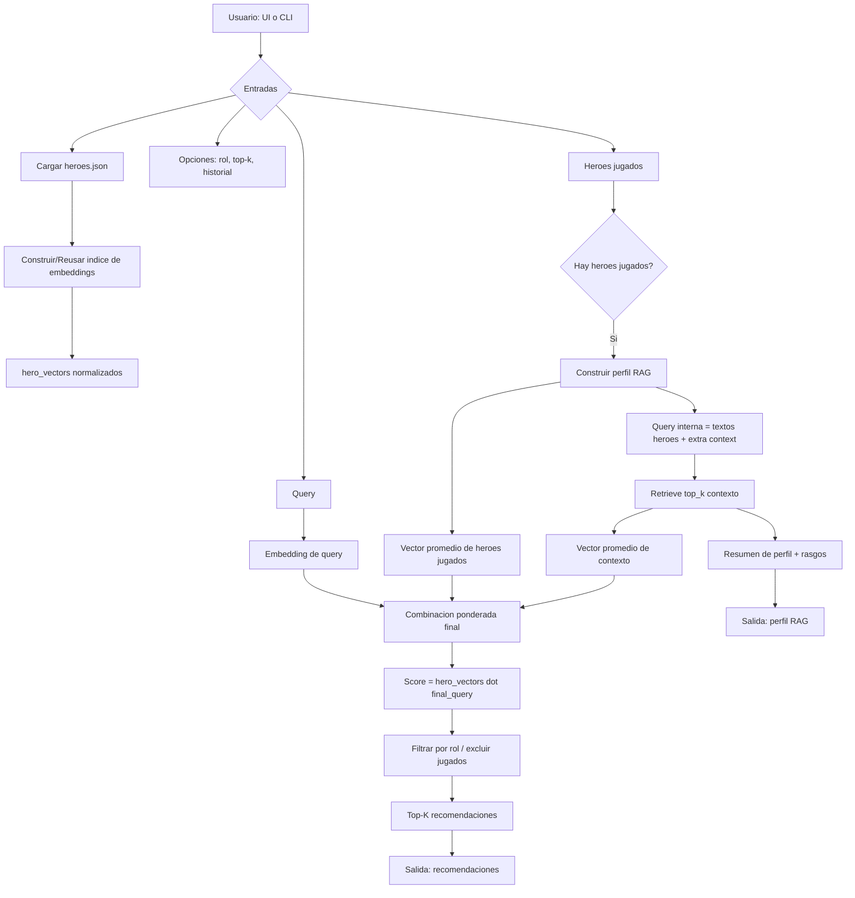

# Diagrama de flujo del proyecto

## Lectura rapida

1. El motor siempre trabaja en espacio vectorial normalizado.
2. RAG se usa para enriquecer el perfil, no para reemplazar la query.
3. La salida final es ranking por similitud semantica.
